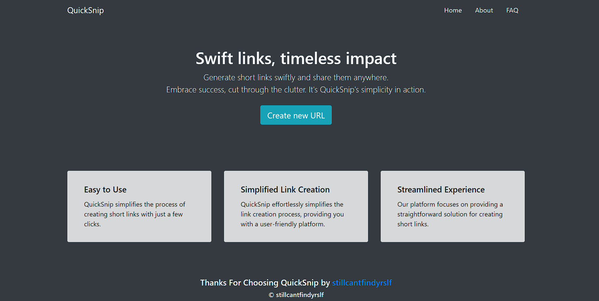

# QuickSnip

Django web application that shortens long urls. Its create and store a simple link that can use for your own purposes.

## Installation

1. `virtualenv YOURENVNAME` - create new [virtualenv](https://virtualenv.pypa.io/en/stable/) for this project (not necessary, but recommended).
2. Navigate to directory containing `requirements.txt`.
3. `pip install -r requirements.txt` - install required packages

## Usage

On first usage you'll need to apply database migrations: `python manage.py migrate`

Otherwise run development server using: `python manage.py runserver`

## Work example

The picture below is an example of work. Its create links something like that 'localhost:8000/xbkjfV'. Paste link in adress bar that after clicking you will be redirected.
